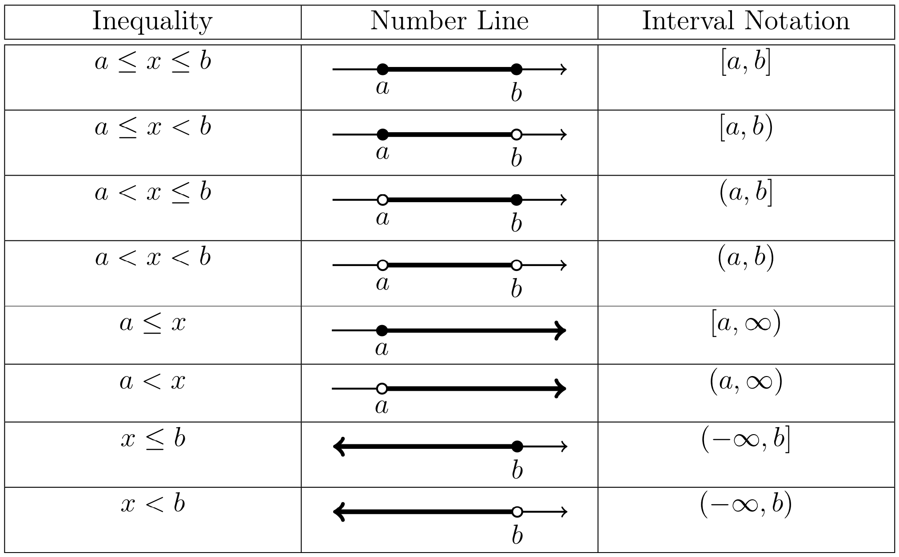

---
jupytext:
  formats: ipynb,md:myst
  text_representation:
    extension: .md
    format_name: myst
    format_version: 0.13
    jupytext_version: 1.10.3
kernelspec:
  display_name: Python 3.9.4 64-bit
  language: python
  name: python3
---
# The Domain of a Function

```{admonition} Definition
:class: tip

The **domain** of a function is the set of all values of $x$ for which the function is defined.
```

When determining the domain of a given function, do not include any value that leads to one or more of the following:

- division by zero
- the square root of a negative number
- the logarithm of zero or a negative number

Students should be familiar with the concepts of division and square roots.  Logarithms will be discussed in class and in a subsequent PSL Course Packet.   While there are other functions that lead to restrictions on the domain, we will limit our discussion to division, square roots, and logarithms.


## Interval Notation

The domain of a function is typically written as a union of intervals.  In this course, we will make use of interval notation to express domains.  This notation is summarized in the following table.



```{dropdown} **Long Text Description**
A table of three columns, expressing the relationship between inequalities of real numbers, written in the leftmost column, diagrams on the number line in the center column, and interval notation in the rightmost column. The rows read as follows:
Row 1: a is less than or equal to x which is less than or equal to b. A solid line segment connecting points a and b in the number line, with filled circles at both ends. [a,b]
Row 2: a is less than or equal to x which is less than b. A line segment in the number line connecting a filled circle at a with an unfilled circle at b. [a,b)
Row 3: a is less than x which is less than or equal to b. A line segment in the number line connecting an unfilled circle at a with a filled circle at b. (a,b]
Row 4: a is less than x which is less than b. A line segment in the number line connecting an unfilled circle at a with an unfilled circle at b. (a,b)
Row 5. a is less than or equal to x. A ray going from a filled circle at a to positive infinity on the right. [a, infinity)
Row 6. a is less than x. A ray going from an unfilled circle at a to positive infinity on the right. (a, infinity)
Row 7. x is less than or equal to b. A ray going from a filled circle at b to negative infinity on the left. (negative infinity, b]
Row 8. x is less than b. A ray going from an unfilled circle at b to negative infinity on the left. (negative infinity, b)

```
Given two intervals, $A$ and $B$, then the union of $A$ and $B$, denoted $A\cup B$, represents the collection of values that are in $A$ or in $B$.  For example,

$$(-\infty,5) \cup [7,10)$$

represents the values that are less than $5$ (i.e., $x<5$) or greater than or equal to $7$ and less than $10$ (i.e., $7\leq x < 10$).


### Example 1 

```{admonition} $ $
:class: tip

Use interval notation to describe the domain of $1/x$.
```

```{dropdown} **Step 1:** &nbsp; Describe the domain of &nbsp; $1/x$ &nbsp; using an inequality.

The domain of $1/x$ includes all real numbers except $x=0$ (i.e., $x<0$ or $x>0$) since division by zero is not defined. 
```

```{dropdown} **Step 2:** &nbsp; Use interval notation to describe the domain of &nbsp; $1/x$.

The domain of $1/x$ consists of all values of $x$ such that $x<0$ or $x>0$, which can be written 
in interval notation as

$$(-\infty,0) \cup (0,\infty).$$
```


### Example 2

```{admonition} $ $
:class: tip


Use interval notation to describe the domain of $\sqrt{x}$.
```

```{dropdown} **Step 1:** &nbsp; Describe the domain of &nbsp; $\sqrt{x}$ &nbsp; using an inequality.

The domain of $\sqrt{x}$ includes all nonnegative real numbers (i.e., $x\geq 0$) since the square root of a negative number is not defined.
```

```{dropdown} **Step 2:** &nbsp; Use interval notation to describe the domain of &nbsp; $\sqrt{x}$. 

The domain of $\sqrt{x}$ consists of all values of $x$ such that $x\geq 0$, which can be written in interval notation as

$$[0,\infty).$$
```


### Example 3

```{admonition} $ $
:class: tip

Determine the domain of the function $f(x) = \sqrt{x^2 + 2x - 3}$.
```

```{dropdown} **Step 1:** &nbsp; Describe the domain using an inequality.

Since $f$ is a square root function, the domain of $f$ consists of all values of $x$ such that
$x^2 + 2x - 3 \geq 0$
since the square root of a negative number is not defined.
```

```{dropdown} **Step 2:** &nbsp; Solve the inequality in Step 1.

Recall from [Solving Inequalities, Example 1](01_05_example1) that 

$$x^2 + 2x - 3 = 0$$

when $x=-3$ or $x=1$ and 

$$x^2 + 2x - 3 > 0$$

when $x<-3$ or $x>1$.

Therefore, the domain of $f$ consists of all values of $x$ such that $x\leq -3$ or $x\geq 1$, which can be written in interval notation as

$$
(-\infty, -3] \cup [1, \infty).
$$
```


### Example 4

```{admonition} $ $
:class: tip

Determine the domain of the function $f(x) = \dfrac{x}{x^2 + 2x - 3}$.
```

```{dropdown} **Step 1:** &nbsp; Describe the domain by excluding all &nbsp; $x$ &nbsp; that make &nbsp; $f(x)$ &nbsp; undefined.

Since $f$ involves the operation of division, the domain of $f$ consists of all values of $x$ such that

$$x^2 +2x - 3 \neq 0$$

since division by zero is not defined.
```

```{dropdown} **Step 2:** &nbsp; Find all values of &nbsp; $x$ &nbsp; that lead to division by zero.

Solve the equation $x^2 + 2x - 3 = 0$.  Recall from [Solving Inequalities, Example 1](01_05_example1) that 

$$x^2 + 2x - 3 = 0$$

when $x=-3$ or $x=1$. 
```

```{dropdown} **Step 3:** &nbsp; Exclude the values found in Step 2 from the domain.

Since the only values of $x$ that lead to division by zero are $x=-3$ and $x=1$, the domain of $f$ consists of all $x$ such that $x<-3$, or $-3<x<1$, or $x>1$, which can be written in interval notation as

$$
(-\infty, -3) \cup (-3, 1) \cup (1, \infty).
$$
```
