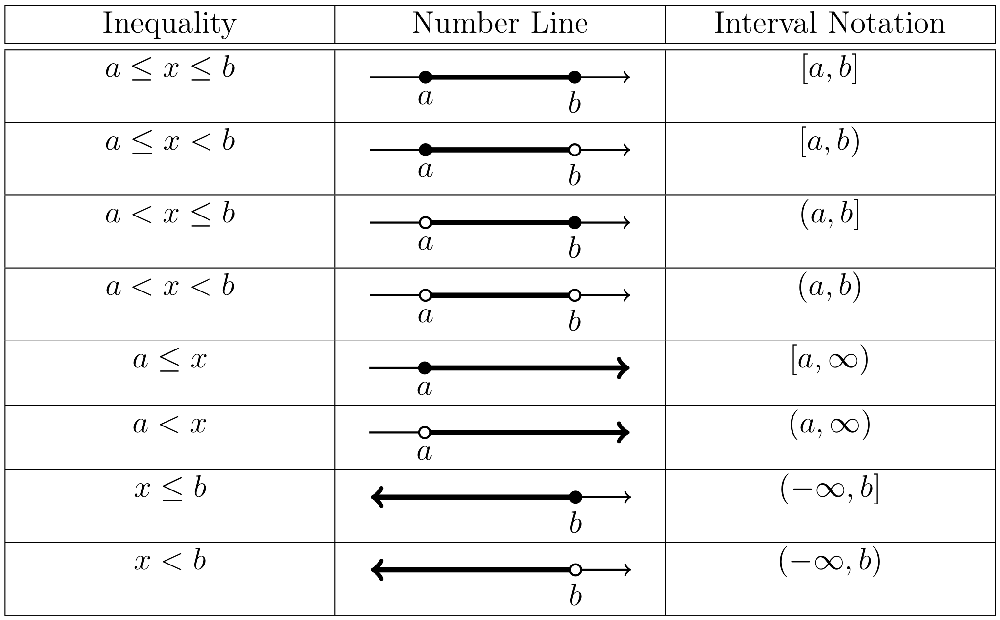

---
jupytext:
  formats: ipynb,md:myst
  text_representation:
    extension: .md
    format_name: myst
    format_version: 0.13
    jupytext_version: 1.10.3
kernelspec:
  display_name: Python 3.9.4 64-bit
  language: python
  name: python3
---
# The Domain of a Function

```{admonition} Definition
:class: tip

The **domain** of a function is the set of all values of $x$ for which the function is defined.
```

When determining the domain of a given function, do not include any value that leads to one or more of the following:

- division by zero
- the square root of a negative number
- the logarithm of zero or a negative number

Students should be familiar with the concepts of division and square roots.  Logarithms will be discussed in class and in a subsequent PSL Course Packet.   While there are other functions that lead to restrictions on the domain, we will limit our discussion to division, square roots, and logarithms.


## Interval Notation

The domain of a function is typically written as a union of intervals.  In this course, we will make use of interval notation to express domains.  This notation is summarized in the following table.



Given two intervals, $A$ and $B$, then the union of $A$ and $B$, denoted $A\cup B$, represents the collection of values that are in $A$ or in $B$.  For example,

$$(-\infty,5) \cup [7,10)$$

represents the values that are less than $5$ (i.e., $x<5$) or greater than or equal to $7$ and less than $10$ (i.e., $7\leq x < 10$).


### Example 1 

```{admonition} $ $
:class: tip

Use interval notation to describe the domain of $1/x$.
```

```{dropdown} **Step 1:** Describe the domain of $1/x$ using an inequality.
:open:

The domain of $1/x$ includes all real numbers except $x=0$ (i.e., $x<0$ or $x>0$) since division by zero is not defined. 
```

```{dropdown} **Step 2:** Use interval notation to describe the domain of $1/x$.

The domain of $1/x$ consists of all values of $x$ such that $x<0$ or $x>0$, which can be written 
in interval notation as

$$(-\infty,0) \cup (0,\infty).$$
```


### Example 2

```{admonition} $ $
:class: tip


Use interval notation to describe the domain of $\sqrt{x}$.
```

```{dropdown} **Step 1:** Describe the domain of $\sqrt{x}$ using an inequality.

The domain of $\sqrt{x}$ includes all nonnegative real numbers (i.e., $x\geq 0$) since the square root of a negative number is not defined.
```

```{dropdown} **Step 2:** Use interval notation to describe the domain of $\sqrt{x}$. 

The domain of $\sqrt{x}$ consists of all values of $x$ such that $x\geq 0$, which can be written in interval notation as

$$[0,\infty).$$
```


### Example 3

```{admonition} $ $
:class: tip

Determine the domain of the function $f(x) = \sqrt{x^2 + 2x - 3}$.
```

```{dropdown} **Step 1:** Describe the domain using an inequality.

Since $f$ is a square root function, the domain of $f$ consists of all values of $x$ such that
$$x^2 + 2x - 3 \geq 0$$
since the square root of a negative number is not defined.
```

```{dropdown} **Step 2:** Solve the inequality in Step 1.

Recall from [Solving Inequalities, Example 1](01_05_example1) that 

$$x^2 + 2x - 3 = 0$$

when $x=-3$ or $x=1$ and 

$$x^2 + 2x - 3 > 0$$

when $x<-3$ or $x>1$.

Therefore, the domain of $f$ consists of all values of $x$ such that $x\leq -3$ or $x\geq 1$, which can be written in interval notation as

$$
(-\infty, -3] \cup [1, \infty).
$$
```


### Example 4

```{admonition} $ $
:class: tip

Determine the domain of the function $f(x) = \dfrac{x}{x^2 + 2x - 3}$.
```

```{dropdown} **Step 1:** Describe the domain by excluding all $x$ that make $f(x)$ undefined.

Since $f$ involves the operation of division, the domain of $f$ consists of all values of $x$ such that

$$x^2 +2x - 3 \neq 0$$

since division by zero is not defined.
```

```{dropdown} **Step 2:** Find all values of $x$ that lead to division by zero.

Solve the equation $x^2 + 2x - 3 = 0$.  Recall from [Solving Inequalities, Example 1](01_05_example1) that 

$$x^2 + 2x - 3 = 0$$

when $x=-3$ or $x=1$. 
```

```{dropdown} **Step 3:** Exclude the values found in Step 2 from the domain.

Since the only values of $x$ that lead to division by zero are $x=-3$ and $x=1$, the domain of $f$ consists of all $x$ such that $x<-3$, or $-3<x<1$, or $x>1$, which can be written in interval notation as

$$
(-\infty, -3) \cup (-3, 1) \cup (1, \infty).
$$
```


```{code-cell} ipython3
---
tags: ["remove-input"]
---
from IPython.display import Markdown, Latex, Math

b = 3
d = 2
s0 = r"Find an equation $$t$$ for the tangent line to the curve"
s1 = r'$$y = x\sqrt{' + str(b)+'x^2 + '+ str(d) + ' }$$'
s2 = r'at the point $(0,1)$'

display(Markdown(s0))
display(Latex(s1))
display(Markdown(s2))
```

```{code-cell} ipython3
---
tags: ["remove-input"]
---
import ipyvuetify as v
import ipywidgets as w

ow = w.Output()

sol = w.HTMLMath(
    value=r"The solution is <i>this</i>: \(x^2\) and $$\frac{x+1}{x-1}$$")

with ow:
    display(sol)
    
    
solution = v.ExpansionPanel(children=[
    v.ExpansionPanelHeader(children=['Show Solution']),
    v.ExpansionPanelContent(children=[sol])])

vep = v.ExpansionPanels(children=[solution])
vl = v.Layout(class_='pa-4', children=[vep])
vl
```

```{code-cell} ipython3
---
tags: ["remove-input"]
---
sol
```

```{code-cell} ipython3
---
tags: ["remove-input"]
---
import sys, os
sys.path.append(os.path.abspath('..'))

from chaldene.quiz import *
from cyllene import *
import random as rd
import sympy as sp

A = rd.randint(3,5)
B = rd.randrange(5,21,5)
D = rd.randint(3,10)
ANS = 2*A*D - B
err2 = [0]
err2.extend(rd.sample([-15,-14,-13,-12,-11,-10,-9,-8,-7,-6,5,6,7,8,9,10,11,12,13,14,15], 4))

expr = "\\frac{f(" + str(D) + "+ h) - f(" + str(D) + ")}{h}"

statement_2 = "If $$f(x) = {}x^2 - {}x,$$ simplify $${}$$".format(A,B,expr)

sign_str = []

for i in range(5):
    if sp.sign(A+err2[i]) < 0:
        sign_str.append('-')
    else: 
        sign_str.append('+')

choices_2 = ["${} {} {}h$".format(sp.latex(2*A*D-B), sign_str[i], abs(A+err2[i])) for i in range(5)]

P2 = MultChoice(statement_2, choices_2)
P2.show_problem()
```
